Bài viết này là những ghi chú của mình trong khi nghiên cứu về UI/UX.

- [Khởi động](#khởi-động)
    - [Hãy bắt đầu từ feature, không phải layout](#hãy-bắt-đầu-từ-feature-không-phải-layout)
    - [Không nên design quá nhiều](#không-nên-design-quá-nhiều)
    - [Hãy chọn một phong cách](#hãy-chọn-một-phong-cách)
    - [Font chữ](#font-chữ)
    - [Border radius](#border-radius)
    - [Giới lại lựa chọn](#giới-lại-lựa-chọn)
- [Mọi thứ đều có cấp độ](#mọi-thứ-đều-có-cấp-độ)
    - [Font size không phải là tất cả](#font-size-không-phải-là-tất-cả)
    - [Không sử dụng màu xám cho khi có màu nền](#không-sử-dụng-màu-xám-cho-khi-có-màu-nền)
    - [Học cách nhấn mạnh](#học-cách-nhấn-mạnh)
    - [Hạn chế dùng label](#hạn-chế-dùng-label)
    - [Linh động phân cấp](#linh-động-phân-cấp)
    - [Cân bằng độ đậm nhạt và độ tương phản](#cân-bằng-độ-đậm-nhạt-và-độ-tương-phản)
    - [Ngữ nghĩa](#ngữ-nghĩa)
- [Layout và Spacing](#layout-và-spacing)
    - [Hãy thêm những khoảng cách](#hãy-thêm-những-khoảng-cách)
    - [Thiết lập một hệ thống khoảng cách và kích thước](#thiết-lập-một-hệ-thống-khoảng-cách-và-kích-thước)
    - [Không cần phải lấp đấy màn hình](#không-cần-phải-lấp-đấy-màn-hình)
    - [Hãy nghĩ tới việc dùng cột](#hãy-nghĩ-tới-việc-dùng-cột)
    - [Nên dùng grids nhưng phải cẩn thận](#nên-dùng-grids-nhưng-phải-cẩn-thận)
    - [Đơn vị relative không tự scale](#đơn-vị-relative-không-tự-scale)
    - [Để ý tới khoảng cách](#để-ý-tới-khoảng-cách)
- [Design text](#design-text)
    - [Thiết lập thang đo](#thiết-lập-thang-đo)
    - [Tránh sử dụng đơn vị em](#tránh-sử-dụng-đơn-vị-em)
    - [Chọn một font chữ tốt](#chọn-một-font-chữ-tốt)
    - [Kiểm soát độ dài text](#kiểm-soát-độ-dài-text)
    - [Dùng baseline, không nên center](#dùng-baseline-không-nên-center)
    - [Khoảng cách các dòng](#khoảng-cách-các-dòng)
    - [Không phải lúc nào link cũng cần màu sắc](#không-phải-lúc-nào-link-cũng-cần-màu-sắc)
    - [Căn giữa những không nên để text căn giữa quá dài](#căn-giữa-những-không-nên-để-text-căn-giữa-quá-dài)
    - [Số thì nên căn phải](#số-thì-nên-căn-phải)
    - [Sử dụng letter-spacing](#sử-dụng-letter-spacing)
- [Làm việc với màu sắc](#làm-việc-với-màu-sắc)
    - [Sử dụng màu HSL](#sử-dụng-màu-hsl)
    - [Bạn thật sự cần nhiều màu hơn bạn nghĩ](#bạn-thật-sự-cần-nhiều-màu-hơn-bạn-nghĩ)
    - [Các bước chọn màu sắc phù hợp](#các-bước-chọn-màu-sắc-phù-hợp)
    - [Làm nổi bật](#làm-nổi-bật)
    - [Đừng quá dựa vào màu sắc](#đừng-quá-dựa-vào-màu-sắc)
- [Tạo độ sâu](#tạo-độ-sâu)
- [Làm việc với hình ảnh](#làm-việc-với-hình-ảnh)
    - [Sử dụng một hình ảnh đẹp](#sử-dụng-một-hình-ảnh-đẹp)
    - [Văn bản cần có độ tương phản nhất quán](#văn-bản-cần-có-độ-tương-phản-nhất-quán)
    - [Đứng scale up/ scale down icons](#đứng-scale-up-scale-down-icons)
    - [Đừng scale down screenshots](#đừng-scale-down-screenshots)
    - [Cẩn thận với hình ảnh người dùng tải lên](#cẩn-thận-với-hình-ảnh-người-dùng-tải-lên)
- [Một số gợi ý khác](#một-số-gợi-ý-khác)
    - [Thay đổi mặc định](#thay-đổi-mặc-định)
    - [Thêm đường viền](#thêm-đường-viền)
    - [Trang trí background](#trang-trí-background)
    - [Đừng để trạng thái trống](#đừng-để-trạng-thái-trống)

# Khởi động

### Hãy bắt đầu từ feature, không phải layout

Khi bắt đầu thiết kế một ứng dụng nào đó thường thì chúng ta sẽ nghĩ ngay đến việc thiết kế bố cục như thế nào. **Stop!!!** Hãy bắt đầu với tính năng của nó, hãy trả lời xem tính năng đó cần những trường gì, cần nút gì!

### Không nên design quá nhiều

Bạn không cần thiết phải design tất cả rồi chuyển sang bước tiếp theo mà hãy thử làm việc theo vòng tròn, liên tục cải thiện và phát triển chúng.

### Hãy chọn một phong cách

Mọi đi design đều có một phong cách, ngân hàng cần tạo sự an toàn chuyên nghiệp, start-up thì có thể thiết kế làm cho vui vẻ và vui tươi.

### Font chữ

Nếu bạn muốn có một vẻ ngoài thanh lịch hoặc cổ điển, bạn có thể muốn kết hợp một kiểu chữ serif trong thiết kế của bạn:

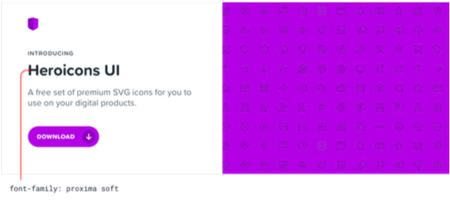

Nếu bạn đang tìm kiếm một cái nhìn đơn giản hơn, hoặc muốn dựa vào các yếu tố khác tạo phong cách, thì neutral sans sẽ rất tuyệt vời:

Mặt chữ tiếng việt

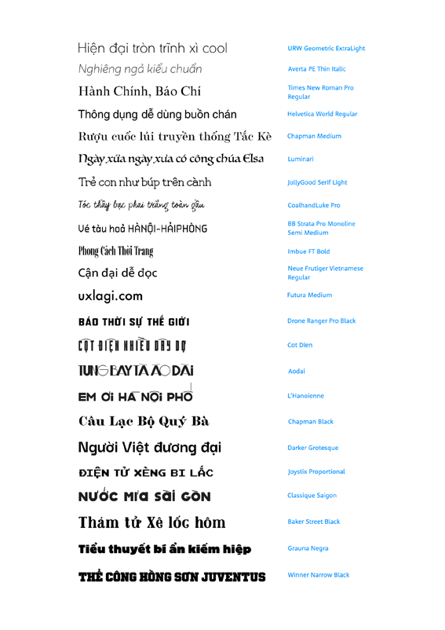

### Border radius

Border radius nhỏ thường không thực sự truyền đạt nhiều về ý nghĩa phong cách

Border radius lớn sẽ mang lại cảm giác vui tươi hơn

Không có border radius sẽ mang lại cảm giác trang trọng

Dù bạn chọn cái nào thì nhất định phải đồng bộ nó trong toàn ứng dụng, không nên pha trộn.

### Giới lại lựa chọn

Có hàng triệu màu sắc và hàng ngàn font chữ để lựa chọn chính vì thế nó sẽ làm bạn tê liệt trong những quyết định. Vì vậy hãy giới hạn những lựa chọn của bạn lại.

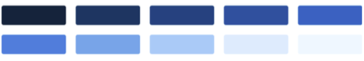

Hãy giới hạn dần dần những lựa chọn trong vố số những lựa chọn.

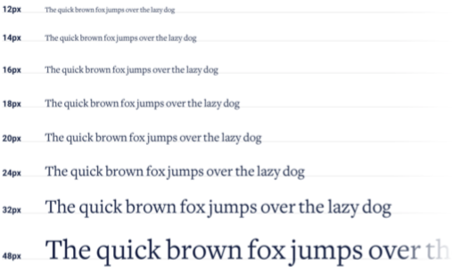

# Mọi thứ đều có cấp độ

Hệ thống phân cấp đề cập đến mức độ quan trọng của các yếu tố trong giao diện xuất hiện trong mối quan hệ với nhau và nó là công cụ hiệu quả nhất mà bạn có để tạo ra thứ gì đó cảm thấy được.

### Font size không phải là tất cả

Sử dụng quá nhiều kích thước để phân cấp là một hành động sai lầm

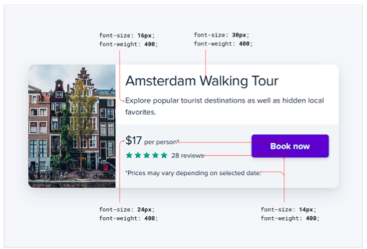

Thay vào đó chúng ta có thể sự dụng màu sắc và độ đậm nhạt của chữ cũng là một cách rất tối ưu

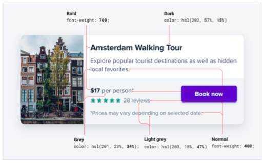

Hãy cố gắng sử dụng 2 đến 3 màu với ý nghĩa như sau:

* Màu tối cho nội dung chính (như tiêu đề của bài viết)
* Màu xám cho nội dung thứ cấp (như ngày bài báo được xuất bản)
* Màu xám nhạt hơn cho nội dung cấp ba (có thể là thông báo bản quyền ở chân trang)

Tương tự có thể sử dụng 2 font-weight là đủ cho một UI tốt:

* Bình thường (400 hoặc 500 tùy thuộc vào phông chữ) cho hầu hết văn bản
* Đậm hơn (600 hoặc 700) cho văn bản bạn muốn nhấn mạnh

### Không sử dụng màu xám cho khi có màu nền

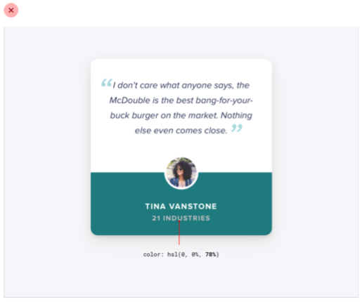

Cách tối ưu cho trường hợp này là chọn màu the same hue, sau đó thay đổi saturation và lightness cho tới khi bạn cảm thấy ổn

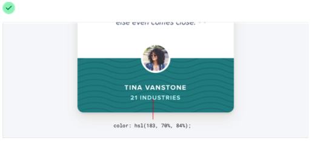

### Học cách nhấn mạnh

Thay vì nhấn mạnh chúng, có thể làm giảm độ quan trọng những phần tử xung quanh chúng

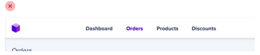

Trường hơn này thanh bên không quan trọng có thể để chúng lẫn vào background

### Hạn chế dùng label

Vì nó sẽ gây khó khăn cho việc phân cấp dữ liệu, và nhấn mạnh phần quan trọng

Và không nhất thiết phải dùng lab vì một số định dạng đã nói lên ý nghĩa của chúng tỷ dụ như email, hay số điện thoại,..

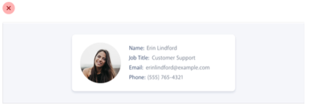

Hoặc có thể kết hợp label với value

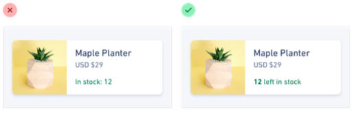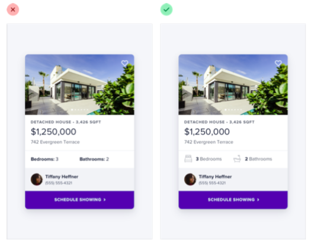

Đôi khi phải dùng thì hãy nên dùng chúng như một đối tượng thứ cấp

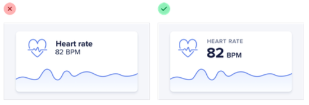

Nhưng cũng có lúc phải nhấn label để thực hiện được mục đích

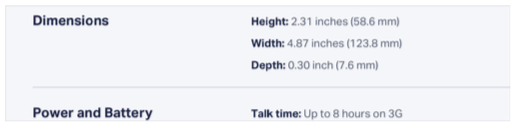

### Linh động phân cấp

Tỷ dụ trong trường hợp này sử dụng H1 là hợp lý về mặt ngữ nghĩa và SEO nhưng về mật phân cấp cho người dùng thì không được ổn.

Trường hợp này chúng ta có thể giảm kích thước của chữ để phù hợp hơn

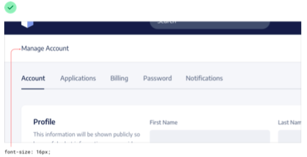

### Cân bằng độ đậm nhạt và độ tương phản

Để tăng độ nhấn mạnh ta có thể chữ in đậm, nhưng quá nhiều thì sẽ làm gây khó chịu, có một cách thay thế để nhấn mạnh đó là chúng ta thêm icon vào.

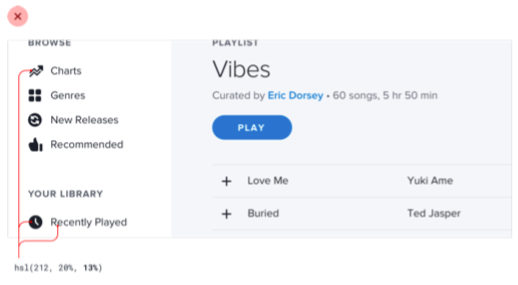

Nhưng làm như trên thì sẽ làm mất cân bằng, và làm ngừoi dùng quá chú ý vào icon, vì thế chúng ta có thể giám độ tương phản của icon để giải quyết trường hợp trên.

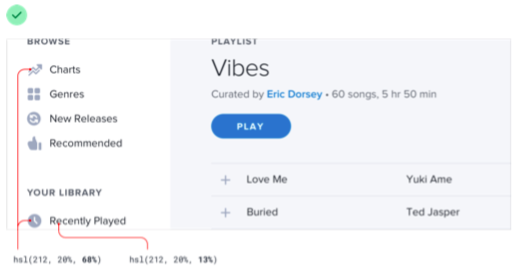

Đây là một trường hợp khác chúng ta nên cân đối độ đậm nhạt và tương phản

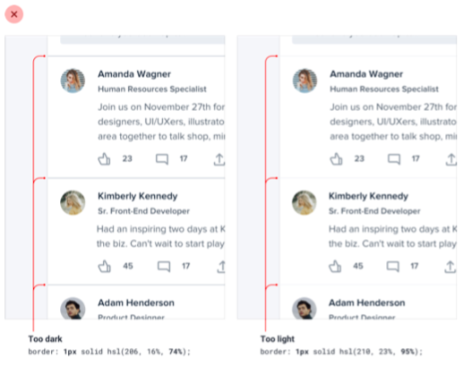

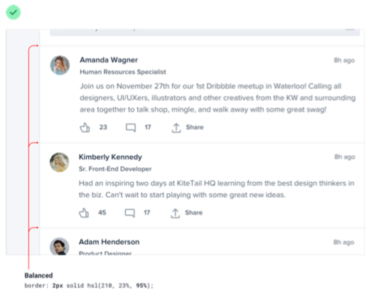

### Ngữ nghĩa

Mặc dù ngữ nghĩa là quan trọng nhưng đừng bao giờ quên sự phân cấp.

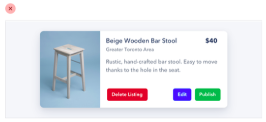

Đây là cách giải quyết cho trường hợp này.

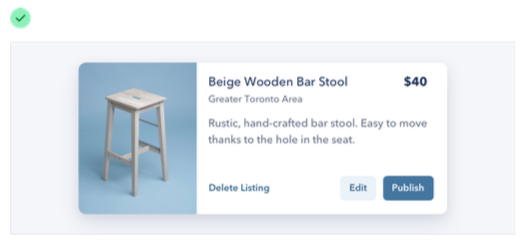

Tham khảo thêm:

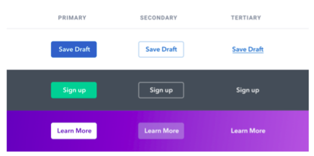

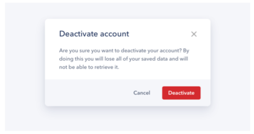

# Layout và Spacing

### Hãy thêm những khoảng cách

Cách giải quyết vấn đề khi thiết kế mang cảm giác ngột ngạt, chật chội là thêm vào giữa chúng những khoảng câch

### Thiết lập một hệ thống khoảng cách và kích thước

Đừng để bản thân phải rơi vào tình trạng 120px hay 123px, hãy thiết lập giới hạn hệ thống khoảng cách và kích thước để follow theo

Việc tạo ra hệ thống này rất đơn giản, bạn cần thiết lập một đơn vị, và sử dụng tất cả với bộ số của đơn vị đó. ví dụ 4px, thì bộ số của nó là 8px, 16px,…

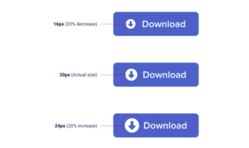

16 là con số tuyệt vời để bạn bắt đầu

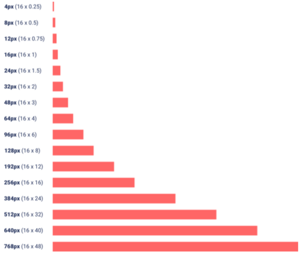

Và mọi thứ sẽ trở nên hoàn hảo hơn

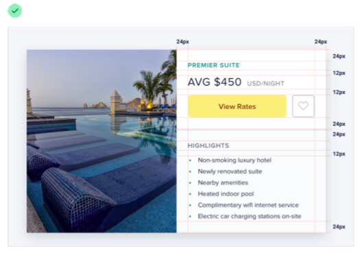

### Không cần phải lấp đấy màn hình

Đây là minh chứng

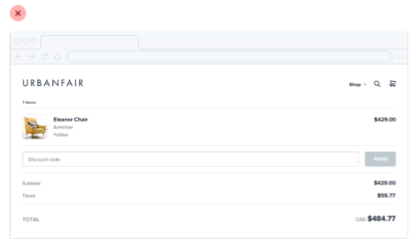

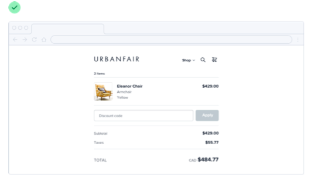

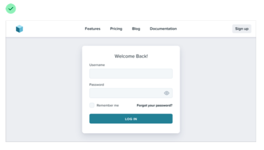

### Hãy nghĩ tới việc dùng cột

Đôi khi bạn gặp phải trường hợp trông không cân bằng và rườm rà thì hãy nghĩ đến việc chia cột

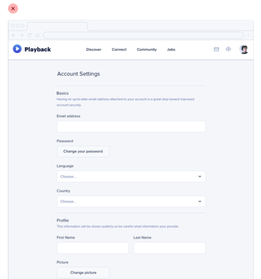

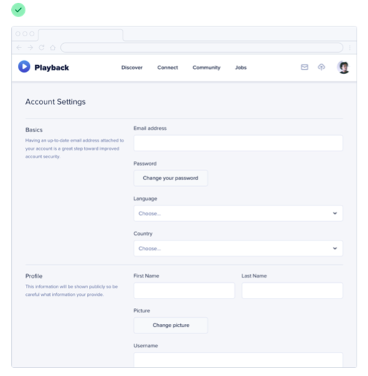

### Nên dùng grids nhưng phải cẩn thận

Ví dụ trong trường hợp này thì ta nên fix phần sidebar ở bên tay trái

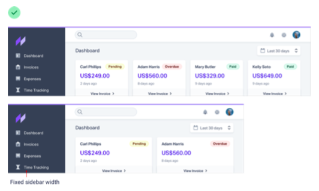

Hay là hình ảnh nên fix kích thước

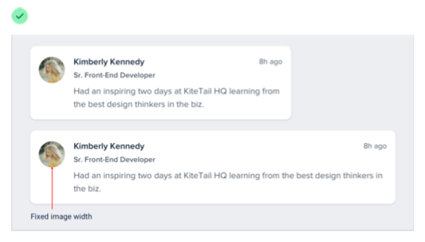

Trưởng hợp này thì lại nên dùng max-width để không bị to card khi chuyển từ màn hình desktop sang tablet

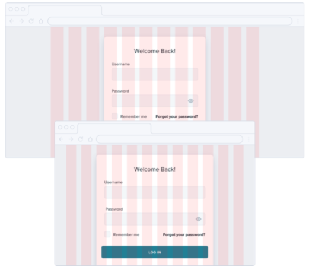

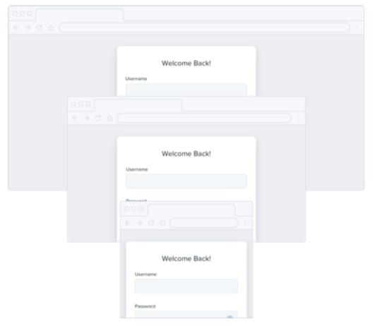

### Đơn vị relative không tự scale

Bạn nên cẩn thận khi sử dụng các đơn vị relative như rem hay em, bởi vì chúng đôi khi không tự động scale như mong muốn khi responsive

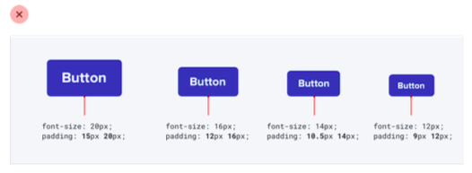

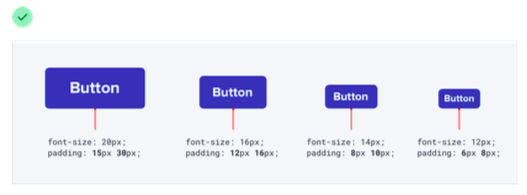

### Để ý tới khoảng cách

Bạn nên để ý tới khoảng cách giữa các phần để tránh gây nhầm lẫn cho user.

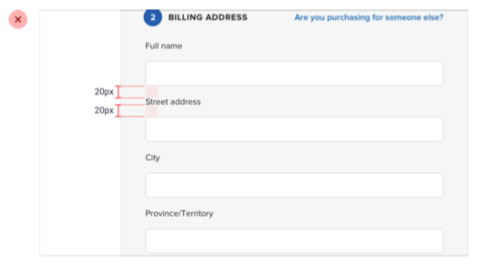

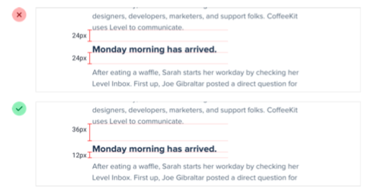

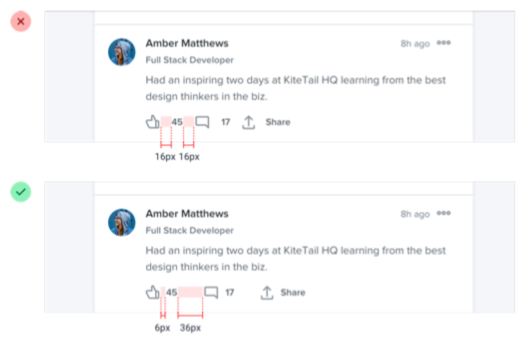

# Design text

### Thiết lập thang đo

Có nhiều cách thiết lập thang đo size text tỷ dụ như tỷ lệ 2:3, tỷ lệ vàng nhưng cách tốt nhất vẫn nên lấy thang đo này phù hợp cho tất cả mọi dự án

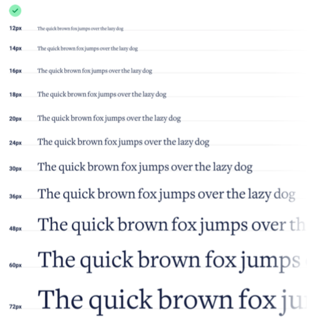

### Tránh sử dụng đơn vị em

Lý do là vì đơn vị em nó không thực sự scale mà nó còn bị ảnh hưởng bơi sự lồng nhau của các thẻ.

### Chọn một font chữ tốt

* Sự lựa chọn an toàn: `-apple-system, Segoe UI, Roboto, Noto Sans, Ubuntu, Cantarell, Helvetica Neue;`
* Bỏ qua những font chữ có weight ít hơn 5
* Hãy tin vào số đông
* Kiểm tra font chữ các trang khác nếu như bạn thích chúng

### Kiểm soát độ dài text

Để có trải nghiệm đọc tốt nhất không gây sự khó chịu, hãy làm cho đoạn văn của bạn đủ rộng để phù hợp với từ 45 đến 75 ký tự trên mỗi dòng.

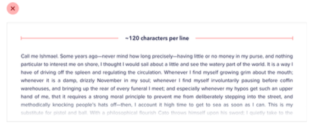

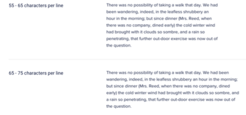

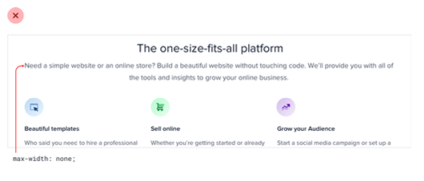

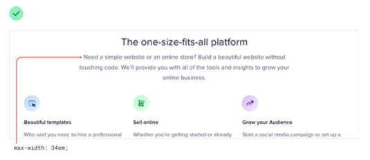

### Dùng baseline, không nên center

Khi có nhiều font-size khác nhau cùng trên một dòng, nếu như chúng xa nhau thì hầu như k có vẫn đề nhưng nếu chúng gần nhau thì nhìn rất tệ. Vì thế cách giải quyết là sử dụng baseline

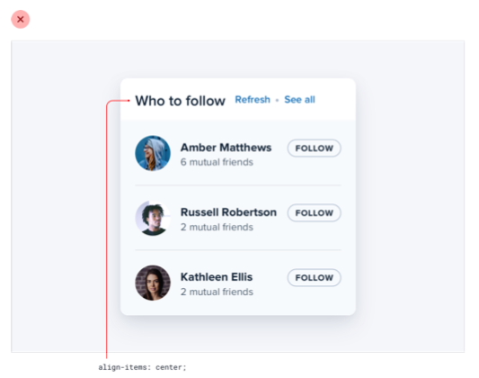

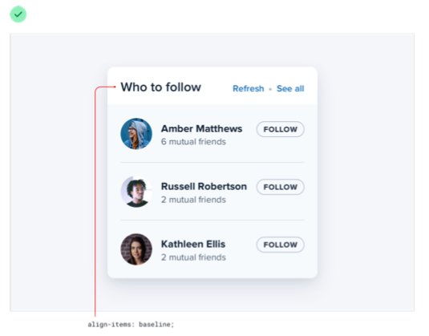

### Khoảng cách các dòng

Chiều cao dòng và chiều rộng đoạn của bạn phải tỷ lệ thuận - nội dung hẹp có thể sử dụng chiều cao dòng ngắn hơn như 1,5, nhưng nội dung rộng có thể cần chiều cao dòng cao tới 2.

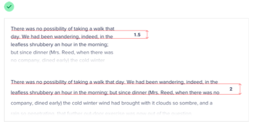

Ngoài ra còn phải dựa vào font-size khi chữ nhỏ chúng ta nên để xa một chút cho ngừoi dùng dễ đọc, không xảy ra trường hợp đọc 2 lần một dòng. Nhưng khi font-size lớn thì nên để hight-line gần hơn tránh cảm giác trống trải.

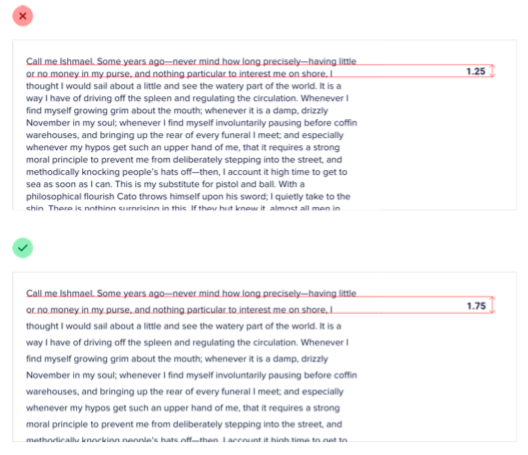

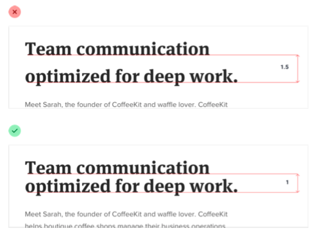

### Không phải lúc nào link cũng cần màu sắc

### Căn giữa những không nên để text căn giữa quá dài

### Số thì nên căn phải

### Sử dụng letter-spacing

Bạn hãy tin tưởng vào người thiết kế font chữ nhưng đôi khi bạn muốn thay đổi khoảng cách các chữ để có một thiết kế ổn hơn.

Title có thể sát hơn một chút

Khi chữ in hoa thì nên để xa một chút

# Làm việc với màu sắc

### Sử dụng màu HSL

HSL thể hiện màu sắc bằng cách sử dụng các thuộc tính mà mắt người nhận thấy bằng trực giác: màu sắc, độ bão hòa và độ sáng.

Hue là một vị trí màu trên bánh xe màu được đo bằng độ, trong đó 0 ° là màu đỏ, 120 ° là màu xanh lá cây và 240 ° là màu xanh lam.

Saturation: là màu sắc sặc sỡ hoặc sống động như thế nào. Độ bão hòa 0% là màu xám (không màu) và độ bão hòa 100% rực rỡ và mãnh liệt.

Lightness: độ sáng 0% là màu đen thuần khiết, độ sáng 100% là màu trắng tinh khiết và độ sáng 50% là màu thuần khiết ở màu sắc nhất định.

### Bạn thật sự cần nhiều màu hơn bạn nghĩ

Nếu bạn nghĩ là chỉ chọn ra một số màu và follow theo chúng để thiết kế thì kế quả nó sẽ ra như thế này

Thực tế là bạn cần hơn thế rất nhiều

Một bảng màu tốt bạn cần chia râ ba thể loại

**Gray**: Text, backgrounds, panels, form controls - hầu hết giao diện đều là màu gray

**Primary**: Là màu chủ đạo của sản phẩm

**Accent**: Trên các màu cơ bản, mỗi trang web cần một vài màu nhấn để truyền đạt những điều khác nhau đến người dùng.

### Các bước chọn màu sắc phù hợp

Chọn màu cơ sở đầu tiên

Tiếp theo chọn màu tối nhất và màu sáng nhất (màu tối nhất thường sẽ là text, màu sáng nhất sẽ là màu background cho element)

Cuối cùng là thêm một số màu vào trung gian, và con số _9_ là một con số đẹp cho việc tạo một danh sách màu

### Làm nổi bật

Thường thì chúng ta sẽ phải để chữ sáng trên nền tối

Nhưng có một cách hay hơn đó là để chữ tối trên nền sáng cũng sẽ mang hiệu quả tương tự

### Đừng quá dựa vào màu sắc

Màu sắc có thể là một cách tuyệt vời để tăng cường thông tin và làm cho nó dễ hiểu hơn, nhưng hãy cẩn thận đừng dựa vào nó tỷ dụ người mù mày sẽ không hiểu chúng

Để fix những tình huống này bạn nên thay vào những icon hoặc text để mô tả chúng

# Tạo độ sâu

Dưới đây là một vài ví dụ

Bóng lớn thường phù hợp với dialog

Kết hợp hai bóng đổ

# Làm việc với hình ảnh

### Sử dụng một hình ảnh đẹp

Những bức ảnh xấu sẽ làm hỏng một thiết kế, ngay cả khi mọi thứ khác về nó trông tuyệt vời.

### Văn bản cần có độ tương phản nhất quán

Giải quyết bài toán này bằng cách, cho hình ảnh tói và chữ màu sáng hoặc ngược lại

Hoặc có thể đổi màu cho hình ảnh

Hay tạo bóng đổ cho text

### Đứng scale up/ scale down icons

Bạn không nên scale up icon lên 3, 4 lần mặc dù nó có là file vector

Nếu bạn muốn to bạn có thể giải quyết bằng cách như sau

### Đừng scale down screenshots

Dưới đây là những cách giải quyết trong trường hợp này

### Cẩn thận với hình ảnh người dùng tải lên

Bản hãy căn giữa hình ảnh và cắn xén những phần không cần thiết

Trường hợp này tỷ dụ người dùng đăng ảnh cùng với màu nền trông sẽ rất tệ

Giải quyết bằng cách thêm vào inner box shadow

# Một số gợi ý khác

### Thay đổi mặc định

### Thêm đường viền

Thêm đường viền lớn vào các thiết kế của bạn cho mọi thứ đỡ nhạt nhẽo

### Trang trí background

### Đừng để trạng thái trống

I hope this could help you!!!

PS: Copy from Internet 🐧🐧🐧